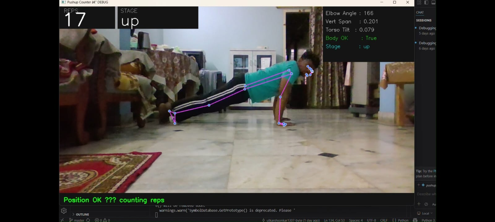
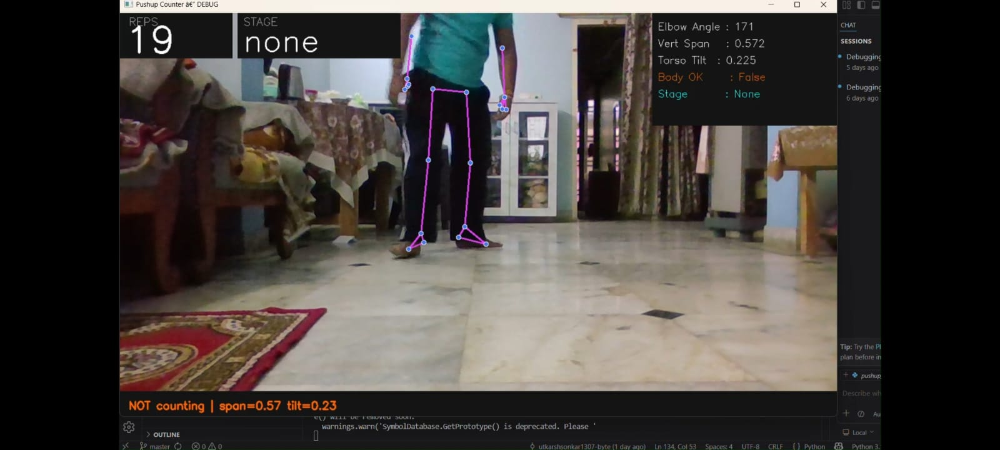

💪 AI Push-Up Counter using Computer Vision

A real-time AI-powered push-up counter built using Python, OpenCV, and MediaPipe.
This project detects body posture using a webcam and automatically counts push-ups based on arm movement and body position.

---

🚀 Features

- 🎯 Real-time push-up detection
- 📷 Uses webcam for live body tracking
- 🤖 Pose detection using MediaPipe
- 🔢 Automatic push-up counting
- 🧠 Basic push-up form detection
- 📝 Logs push-up data into a file
- ⚡ Lightweight and fast execution

---

🛠️ Technologies Used

- Python
- OpenCV
- MediaPipe
- NumPy

---

📂 Project Structure

PUSHUP-COUNTER/
│
├── pushup_counter.py     # Main push-up counter program
├── utils.py              # Helper functions
├── pushup_log.txt        # Stores push-up logs
├── requirements.txt      # Python dependencies
├── .gitignore
└── README.md

---

⚙️ Installation

Step 1 — Clone the Repository

git clone https://github.com/utkarshsonkar1307-byte/PUSHUP-COUNTER.git
cd PUSHUP-COUNTER

---

Step 2 — Install Dependencies

Make sure Python is installed, then run:

pip install -r requirements.txt

If requirements.txt is missing, install manually:

pip install opencv-python mediapipe numpy

---

▶️ How to Run the Project

Run the following command:

python pushup_counter.py

After running:

- Your webcam will open
- The system will detect your body posture
- Push-ups will be counted automatically

Press:

Q

to exit the program.

---

🧠 How It Works

1. The webcam captures live video frames.
2. MediaPipe detects body landmarks.
3. Arm angle is calculated using joint positions.
4. When the correct push-up motion is detected:
   - Rep counter increases
   - Feedback is displayed on screen
5. Push-up data is saved in:

pushup_log.txt

---

📸 Demo

(Add your screenshot here after taking one)

## 📸 Demo

To add demo:

1. Run your project
2. Take a screenshot
3. Save it as:

demo.png

4. Upload it to the repository

---

📊 Future Improvements

- 📈 Workout analytics dashboard
- 🧍 Advanced push-up form correction
- 🔊 Voice feedback system
- 🌐 Web-based version using Streamlit
- 📱 Multi-exercise support (Squats, Pull-ups)
- 📊 Performance tracking over time

---

🤝 Contributing

Contributions are welcome!

Steps:

1. Fork the repository
2. Create a new branch
3. Make changes
4. Submit a pull request

---

📜 License

This project is open-source and available under the MIT License.

---

👨‍💻 Author

Utkarsh Sonkar
Engineering Student | Python Developer | Computer Vision Enthusiast

🔗 GitHub Profile:
https://github.com/utkarshsonkar1307-byte

---

⭐ Show Your Support

If you like this project:

- ⭐ Star this repository
- 🍴 Fork it
- 🧠 Try improving it

It motivates further development!
